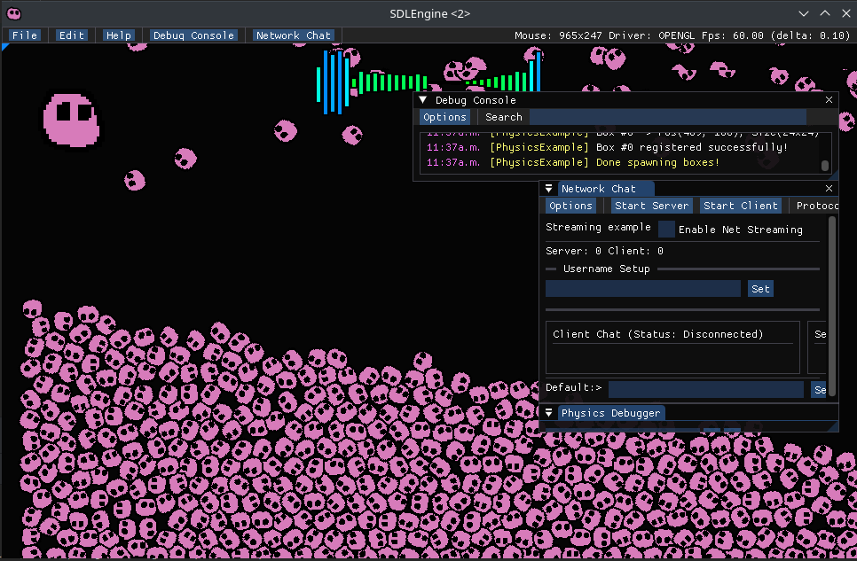

# SDL2Game
A game template example for the SDL2 Engine.

SDL2Engine: https://github.com/EZroot/SDL2Engine

## Features
- Simple Audio Visualizer
- Animated sprites
- Box2D Physics
- Pulsing sprite to music
- Network chat
- Debug Console window

## Prerequisites

SDL2Engine: https://github.com/EZroot/SDL2Engine
