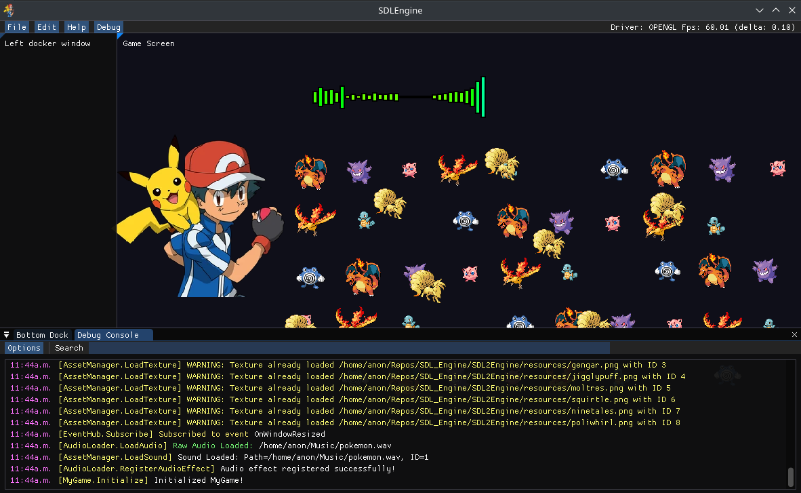

# SDL2Game
A game template example for the SDL2 Engine.

SDL2Engine: https://github.com/EZroot/SDL2Engine

## Features

- Audiosynthesizer 
- - Displaying extracted audio band frequencies
- Dancing Sprites
- - Sprites pulse to the audio

## Prerequisites

SDL2Engine: https://github.com/EZroot/SDL2Engine